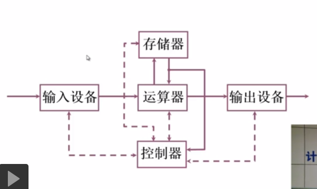
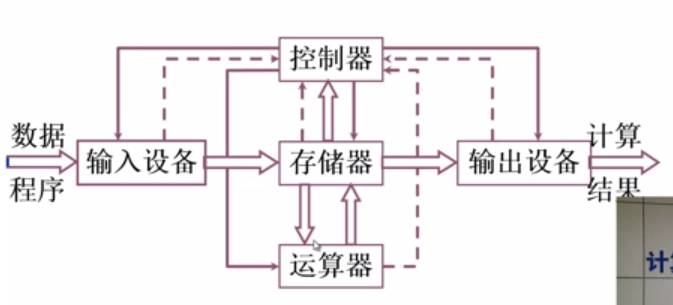
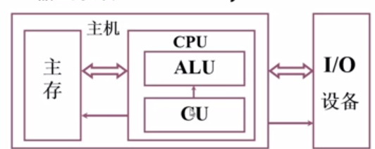

# 1.2 计算机的基本组成

## 一. 冯诺依曼计算机的特点
EDVAC方案--冯诺依曼
1. 计算机由五大部件组成
2. 指令和数据同等存放于存储器,按地址访问
3. 指令和数据用二进制表示
4. 指令由操作码和地址码组成
5. **存储程序**(核心特征)
6. 以运算器为中心
   
存储程序是冯诺依曼机器的核心特点.\
### 1. 五大部件
1. 运算器
   >算术运算和逻辑运算
2. 控制器
   >指挥程序的运行
3. 存储器
   >存放数据和程序
4. 输入设备
   >将信息转化成机器能识别的形式
5. 输出设备
   >将结果转化成人可以识别的形式

### 2. 指令和数据存放于存储器
例外: 指令cache, 数据cache, 并且按内容索引
### 3. 二进制表示
可不可能用三进制,四进制,十进制表示
### 4. 指令操作码和地址码
指定运算的类型以及操作数的类型,指定操作数的地址
### 5. 存储程序
程序存储在存储器上,按地址访问并顺序执行指令
### 6. 以运算器为中心
是否可以以其他设备为中心?

## 二. 计算机硬件框图

1. 以运算器为核心的硬件框图
   
   
2. 以存储器为核心的硬件框图
   
   
3. 层次化的硬件框图
   
   

### 应对系统复杂性管理的方法 (3'Y)
- 层次化(Hierachy): 将被设计的系统划分为多个模块或子模块
- 模块化(Modularity): 有明确定义(well-defined)的功能和借口
- 规则性(regularity): 模块更容易被重用,满足一定的标准

## 三. 计算机的工作步骤

1. 问题: 一个现实中的问题,如何用计算机来解决?
> 首先考虑能否用计算机解决.
2. 问题: 是不是所有的问题都能用计算机解决?
> 不是所有问题都能用计算机解决,研究计算可行性的理论叫做可计算性理论,又称为算法理论.\
> 比如: 煎鸡蛋不能被计算机直接解决\
> 又比如: 图灵机停机问题不能被计算机解决
>> 图灵机问题: 是否存在一台万能的图灵机,可以在有限时间内判断任意图灵机是否能停机,即给出明确答案是或者不是.
3. 问题: 如何用计算机解决一个能用计算机解决的问题?\
### **计算机的工作步骤**
1. 上机前的准备
   - 确定数学模型: `$u = U_0 sin(\omega t)$`
   - 确定计算方法: `$ sin x = x - \frac{x^3}{3!} + \frac{x^5}{5!}+...$`
   - 编制结题程序: 程序是运算的全部步骤, 指令是每一个运算步骤
2. 编写指令
   - 指令由二进制组成,每一条指令执行特定的功能,如相加,相乘,加载字,存放字
   - 指令由操作码和操作数组成
3. 存储器的组成
   - 指令存放在存储器中,以供计算机加载使用
   - 存储器概念包括存储单元,存储字和存储字长
     > 存储单元: 可以存档一组二进制代码的电子器件,存放一个存储字
     
     > 存储字: 存储单元中的二进制代码组合

     > 存储字长: 一个存储字的位(bit)数,每个存储单元(存储字)有一个地址
    - MAR: Memory Address Register, 存储器地址寄存器, 可以反映存储单元的个数
    - MDR: Memory Data Register, 存储器数据寄存器, 长度和处存储字长相同
